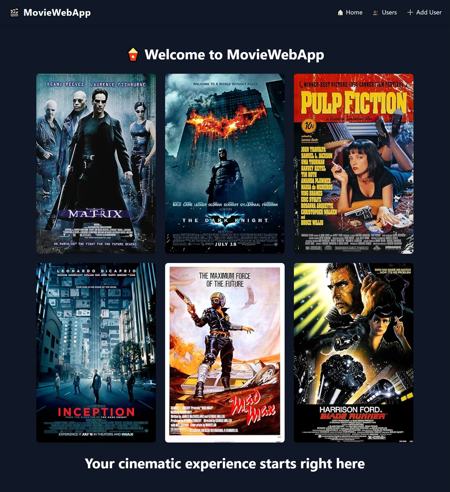
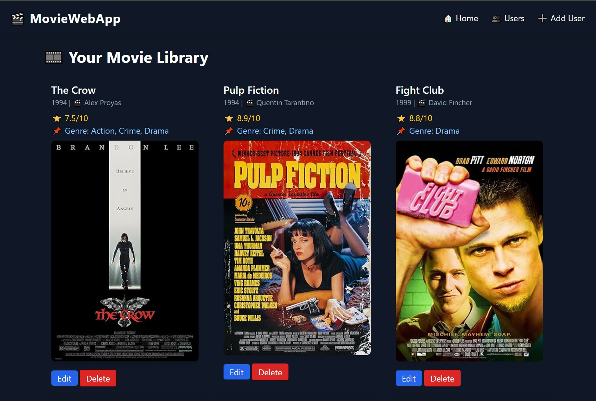

# MovieWeb - Your Personal Movie Library

## 🎬 About MovieWeb

MovieWeb is a sleek, feature-rich Flask web application designed to help users curate and manage their personal movie library. Add movies, update details, delete them, and explore additional movie information fetched dynamically via the OMDb API.

This project utilizes SQLAlchemy for database management, Flask for backend routing, and TailwindCSS for a modern and clean UI.

## ✨ Features

- 📝 **User Management:** Create users who each have their own personal movie collection.
- 🎞️ **Movie Collection:** Add movies to your library with details automatically retrieved from OMDb.
- 🛠️ **Editing & Deleting:** Update or remove movies from your list seamlessly.
- 🔥 **Dynamic UI:** A fully responsive, dark-themed design using TailwindCSS.
- 🌍 **API Support:** Provides RESTful API endpoints to fetch user and movie data.
- 🔍 **Search & Filtering:** Easily search and browse movies by genre.
- 🚀 **Robust Error Handling:** Graceful fallbacks and structured logging to keep things running smoothly.

## 🚀 Technologies Used

- **Backend:** Flask, SQLAlchemy
- **Frontend:** Jinja2, TailwindCSS
- **Database:** SQLite
- **API Integration:** OMDb API
- **Logging:** Built-in Python logging module

## 🛠 Installation & Setup

### Prerequisites:

Ensure you have Python (>=3.8) and pip installed.

### 1️⃣ Clone the Repository

```bash
 git clone https://github.com/your-username/movieweb.git
 cd movieweb
```

### 2️⃣ Create a Virtual Environment & Install Dependencies

```bash
 python -m venv .venv
 source .venv/bin/activate  # On Windows use: .venv\Scripts\activate
 pip install -r requirements.txt
```

### 3️⃣ Set Up Environment Variables

Create a `.env` file and set up your OMDb API key:

```ini
OMDB_API_KEY=your_api_key_here
FLASK_APP=app.py
FLASK_ENV=development
```

### 4️⃣ Initialize the Database

```bash
 flask db init
 flask db migrate -m "Initial migration."
 flask db upgrade
```

### 5️⃣ Run the Application

```bash
 flask run
```

The app should now be available at [http://127.0.0.1:5000](http://127.0.0.1:5000) 🎉

## 📡 API Endpoints

MovieWeb provides RESTful API access to its data:

| Method | Endpoint                      | Description                      |
| ------ | ----------------------------- | -------------------------------- |
| GET    | `/api/users`                  | Fetch all users                  |
| GET    | `/api/users/<user_id>/movies` | Get movies for a user            |
| GET    | `/api/movies/<movie_id>`      | Get details for a specific movie |

## 🛠️ Contribution

Want to improve MovieWeb? Contributions are welcome!

1. Fork the repository
2. Create a new branch (`feature/amazing-feature`)
3. Commit your changes
4. Push to the branch and open a PR

## 📜 License

This project is open-source and available under the MIT License.

---

💻 "Code meets cinema—built by a movie enthusiast for movie enthusiasts! 🎥✨"


## 📸 Screenshots

### 🎬 Homepage


### 🎞️ User Movies Page



